# MediaCrawler 源码小白阅读教程

> 适合对象：刚接触 Python 后端、异步爬虫、开源项目源码阅读的同学。  
> 阅读目标：不是一次性看懂所有代码，而是按“入口 -> 主流程 -> 登录 -> 请求 -> 存储 -> 代理 -> 数据库”的顺序，建立一张清晰地图。  
> 当前分析仓库：`/Users/agan/Documents/code/MediaCrawler`，当前提交：`d280d22`。

---

## 1. 基本使用 (Basic Usage)

### 1.1 课程基本介绍 / 入门教程方案

MediaCrawler 是什么？

一句话：它是一个用 Python 写的多平台自媒体爬虫项目，可以抓取小红书、抖音、快手、B站、微博、百度贴吧、知乎等平台的公开内容、评论和创作者信息。

你可以先看这几个文件：

| 你想知道 | 看哪个文件 | 重点位置 |
|---|---|---|
| 项目能做什么 | `README.md` | 第 32-40 行 |
| 支持哪些平台 | `README.md` | 第 43-52 行 |
| 怎么运行 | `README.md` | 第 84-153 行 |
| 项目架构 | `docs/项目架构文档.md` | 第 1-29 行 |
| 数据怎么保存 | `docs/data_storage_guide.md` | 第 1-28 行 |

支持平台：

| 平台 | 命令行代号 | 主要能力 |
|---|---|---|
| 小红书 | `xhs` | 笔记搜索、笔记详情、评论、创作者 |
| 抖音 | `dy` | 视频搜索、视频详情、评论、创作者 |
| 快手 | `ks` | 视频搜索、视频详情、评论 |
| B站 | `bili` | 视频、评论、UP主 |
| 微博 | `wb` | 微博、评论、博主 |
| 百度贴吧 | `tieba` | 帖子、评论、用户 |
| 知乎 | `zhihu` | 问答/文章、评论、答主 |

最小运行步骤：

```bash
# 1. 安装依赖
uv sync

# 2. 运行小红书关键词搜索
uv run main.py --platform xhs --lt qrcode --type search

# 3. 运行小红书指定笔记详情
uv run main.py --platform xhs --lt qrcode --type detail

# 4. 查看所有参数
uv run main.py --help
```

小白先记住三个核心参数：

| 参数 | 例子 | 含义 |
|---|---|---|
| `--platform` | `xhs` | 选择哪个平台 |
| `--lt` | `qrcode` | 用什么方式登录 |
| `--type` | `search` | 做搜索、详情还是创作者爬取 |

### 1.2 命令行参数讲解

程序从哪里开始？

入口文件是 `main.py`。最重要的是 `main.py` 第 100-110 行：

```python
args = await cmd_arg.parse_cmd()
if args.init_db:
    await db.init_db(args.init_db)
    return

crawler = CrawlerFactory.create_crawler(platform=config.PLATFORM)
await crawler.start()
```

这几行可以翻译成大白话：

1. 先解析你在命令行输入的参数。
2. 如果你只是要初始化数据库，就初始化完直接退出。
3. 否则根据平台创建一个爬虫对象。
4. 调用这个爬虫对象的 `start()` 方法开始工作。

平台是怎么选出来的？

看 `main.py` 第 50-68 行：

```python
CRAWLERS = {
    "xhs": XiaoHongShuCrawler,
    "dy": DouYinCrawler,
    "ks": KuaishouCrawler,
    "bili": BilibiliCrawler,
    "wb": WeiboCrawler,
    "tieba": TieBaCrawler,
    "zhihu": ZhihuCrawler,
}
```

这就是一个“平台代号 -> 爬虫类”的字典。  
比如你输入：

```bash
uv run main.py --platform xhs
```

程序就会创建 `XiaoHongShuCrawler()`。

命令行参数在哪里定义？

在 `cmd_arg/arg.py`。这个项目用的是 Typer，不是 argparse。

你重点看：

- 平台枚举：`cmd_arg/arg.py` 第 40-49 行。
- 登录方式枚举：第 52-58 行。
- 爬取类型枚举：第 60-66 行。
- 存储方式枚举：第 68-79 行。
- 参数 callback：第 154-319 行。
- 把参数写入全局配置：第 332-349 行。

重要参数表：

| 参数 | 定义位置 | 小白解释 |
|---|---:|---|
| `--platform` | `cmd_arg/arg.py:161-168` | 选择平台，比如小红书 `xhs` |
| `--lt` | `cmd_arg/arg.py:169-176` | 登录方式，二维码、手机号、Cookie |
| `--type` | `cmd_arg/arg.py:177-184` | 爬取模式，搜索、详情、创作者 |
| `--keywords` | `cmd_arg/arg.py:193-200` | 搜索关键词 |
| `--save_data_option` | `cmd_arg/arg.py:228-237` | 数据保存到 csv/json/db/sqlite 等 |
| `--specified_id` | `cmd_arg/arg.py:254-261` | 指定内容 ID 或 URL |
| `--creator_id` | `cmd_arg/arg.py:262-269` | 指定创作者 ID |
| `--max_concurrency_num` | `cmd_arg/arg.py:278-285` | 最大并发数量 |
| `--enable_ip_proxy` | `cmd_arg/arg.py:294-302` | 是否开启代理 IP |

小白理解重点：

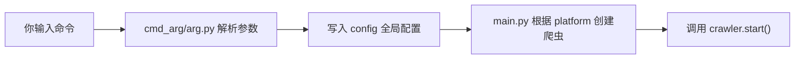

---

## 2. 源码分析 (Source Code Analysis)

### 2.1 流程图和类图

先看项目的四个“抽象基类”。

文件：`base/base_crawler.py`

| 类名 | 位置 | 它代表什么 |
|---|---:|---|
| `AbstractCrawler` | 第 26-64 行 | 一个平台爬虫应该会做什么 |
| `AbstractLogin` | 第 67-83 行 | 一个登录器应该会做什么 |
| `AbstractStore` | 第 86-100 行 | 一个存储器应该会做什么 |
| `AbstractApiClient` | 第 119-127 行 | 一个请求客户端应该会做什么 |

可以把它们理解成“规定动作”：

```python
class AbstractCrawler(ABC):
    async def start(self):
        pass

    async def search(self):
        pass
```

意思是：只要你是一个平台爬虫，就必须有 `start()` 和 `search()`。

类图：

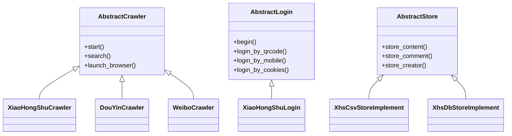

完整生命周期流程图：

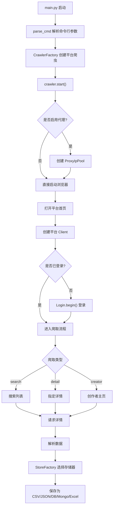

小白阅读建议：

1. 先看 `main.py`，知道程序从哪里进。
2. 再看 `media_platform/xhs/core.py`，先只看小红书一个平台。
3. 看懂小红书后，再对比抖音、微博、知乎。

### 2.2 登录类源码

登录代码在哪里？

每个平台都有自己的登录文件：

| 平台 | 文件 | 登录类 |
|---|---|---|
| 小红书 | `media_platform/xhs/login.py` | `XiaoHongShuLogin` |
| 抖音 | `media_platform/douyin/login.py` | `DouYinLogin` |
| 微博 | `media_platform/weibo/login.py` | `WeiboLogin` |
| 知乎 | `media_platform/zhihu/login.py` | `ZhiHuLogin` |
| B站 | `media_platform/bilibili/login.py` | `BilibiliLogin` |
| 快手 | `media_platform/kuaishou/login.py` | `KuaishouLogin` |
| 贴吧 | `media_platform/tieba/login.py` | `BaiduTieBaLogin` |

先看小红书。

文件：`media_platform/xhs/login.py`

核心方法：

| 方法 | 位置 | 作用 |
|---|---:|---|
| `begin()` | 第 87-97 行 | 根据登录方式分发 |
| `login_by_qrcode()` | 第 167-211 行 | 二维码登录 |
| `login_by_mobile()` | 第 99-165 行 | 手机号验证码登录 |
| `login_by_cookies()` | 第 213-224 行 | Cookie 登录 |
| `check_login_state()` | 第 51-85 行 | 检查是否登录成功 |

小白重点看 `begin()`：

```python
if config.LOGIN_TYPE == "qrcode":
    await self.login_by_qrcode()
elif config.LOGIN_TYPE == "phone":
    await self.login_by_mobile()
elif config.LOGIN_TYPE == "cookie":
    await self.login_by_cookies()
```

这段非常好懂：你传什么登录类型，它就调用什么登录方法。

Cookie 是怎么处理的？

小红书 Cookie 登录在 `media_platform/xhs/login.py` 第 213-224 行：

```python
for key, value in utils.convert_str_cookie_to_dict(self.cookie_str).items():
    if key != "web_session":
        continue
    await self.browser_context.add_cookies([...])
```

意思是：

1. 把你传入的 Cookie 字符串转成字典。
2. 只取 `web_session`。
3. 调用 Playwright 的 `browser_context.add_cookies()` 塞进浏览器。

验证码怎么处理？

- 小红书：`check_login_state()` 第 71-73 行发现“请通过验证”时提示人工处理。
- 抖音：`media_platform/douyin/login.py` 第 171-210 行有滑块检测；第 213-264 行用图片识别加鼠标轨迹模拟滑动。

抖音滑块关键代码：

```python
# media_platform/douyin/login.py:237-243
slide_app = utils.Slide(gap=gap_src, bg=slide_back)
distance = slide_app.discern()
tracks = utils.get_tracks(distance, slider_level)
```

小白理解：

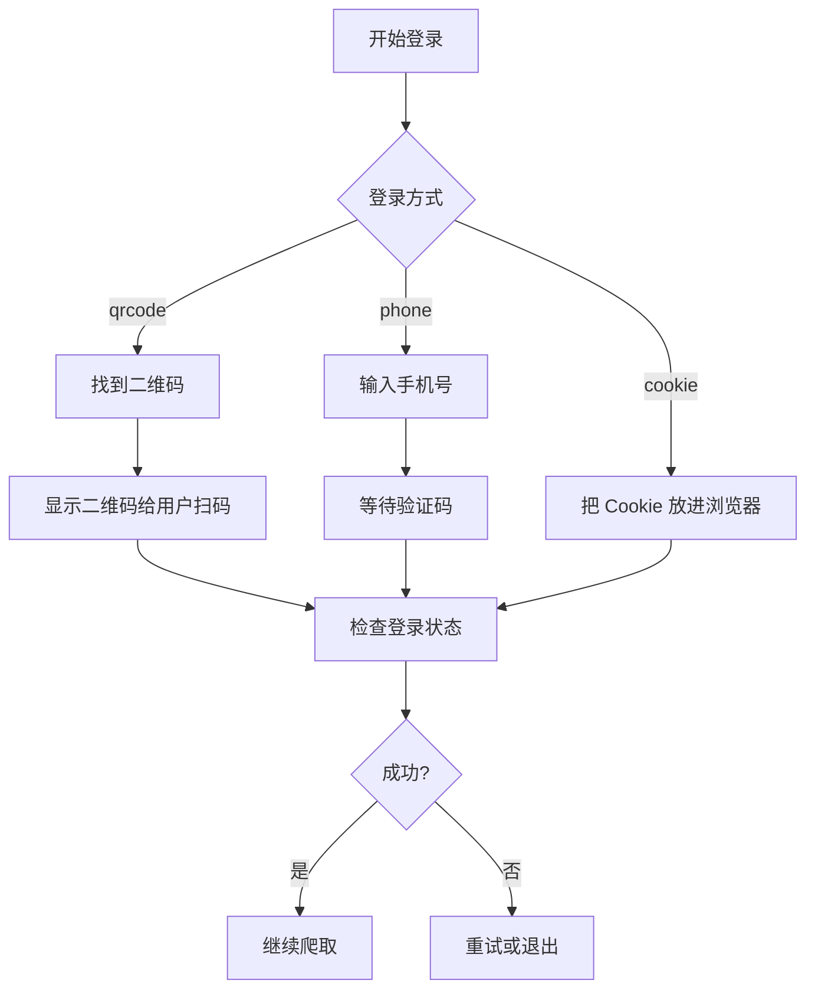

### 2.3 请求客户端封装

小白先理解什么是 Client。

Crawler 负责“安排流程”，Client 负责“真正发请求”。  
比如小红书：

- 主流程类：`XiaoHongShuCrawler`
- 请求客户端：`XiaoHongShuClient`

【未找到】统一叫 `RequestClient` 的类。这个项目是每个平台各写一个 Client。

常见 Client 文件：

| 平台 | 文件 | 类名 |
|---|---|---|
| 小红书 | `media_platform/xhs/client.py` | `XiaoHongShuClient` |
| 抖音 | `media_platform/douyin/client.py` | `DouYinClient` |
| 微博 | `media_platform/weibo/client.py` | `WeiboClient` |
| 知乎 | `media_platform/zhihu/client.py` | `ZhiHuClient` |
| 贴吧 | `media_platform/tieba/client.py` | `BaiduTieBaClient` |

统一的 httpx 创建函数在 `tools/httpx_util.py` 第 6-13 行：

```python
def make_async_client(**kwargs) -> httpx.AsyncClient:
    kwargs.setdefault("verify", not getattr(config, "DISABLE_SSL_VERIFY", False))
    return httpx.AsyncClient(**kwargs)
```

它只做了一件事：统一控制 SSL 验证，然后返回 `httpx.AsyncClient`。

小红书 Client 怎么发请求？

文件：`media_platform/xhs/client.py`

| 方法 | 位置 | 作用 |
|---|---:|---|
| `__init__()` | 第 47-76 行 | 保存 headers、cookie、proxy、page |
| `_pre_headers()` | 第 78-113 行 | 生成小红书请求签名 |
| `request()` | 第 115-154 行 | 发请求并处理错误 |
| `get()` | 第 165-185 行 | GET 请求 |
| `post()` | 第 187-205 行 | POST 请求 |
| `update_cookies()` | 第 264-277 行 | 从浏览器更新 Cookie |

关键代码：

```python
# media_platform/xhs/client.py:127-133
await self._refresh_proxy_if_expired()
async with make_async_client(proxy=self.proxy) as client:
    response = await client.request(method, url, timeout=self.timeout, **kwargs)
```

这段大白话：

1. 请求前看看代理 IP 有没有过期。
2. 创建 httpx 客户端。
3. 发出 HTTP 请求。

重试机制：

- 小红书：`media_platform/xhs/client.py` 第 115 行，失败最多重试 3 次。
- 微博：`media_platform/weibo/client.py` 第 72 行，失败最多重试 5 次。
- 知乎：`media_platform/zhihu/client.py` 第 85 行，失败最多重试 3 次。
- 贴吧：`media_platform/tieba/client.py` 第 236 行，失败最多重试 3 次。

User-Agent 轮换：

【未找到】统一的 User-Agent 池和自动轮换机制。  
例如小红书在 `media_platform/xhs/core.py` 第 61 行使用固定 UA。

### 2.4 存储类实现 (csv/json/db)

数据抓下来以后保存在哪里？

项目支持：

- CSV
- JSON
- JSONL
- SQLite
- MySQL
- PostgreSQL
- MongoDB
- Excel

存储工厂是什么？

以小红书为例，看 `store/xhs/__init__.py` 第 33-50 行：

```python
STORES = {
    "csv": XhsCsvStoreImplement,
    "db": XhsDbStoreImplement,
    "postgres": XhsDbStoreImplement,
    "json": XhsJsonStoreImplement,
    "jsonl": XhsJsonlStoreImplement,
    "sqlite": XhsSqliteStoreImplement,
    "mongodb": XhsMongoStoreImplement,
    "excel": XhsExcelStoreImplement,
}
```

小白理解：  
你在命令行里写：

```bash
--save_data_option jsonl
```

程序就会选择 `XhsJsonlStoreImplement`。

CSV/JSON/JSONL：

文件：`store/xhs/_store_impl.py`

| 类名 | 位置 | 作用 |
|---|---:|---|
| `XhsCsvStoreImplement` | 第 42-68 行 | 保存 CSV |
| `XhsJsonStoreImplement` | 第 71-100 行 | 保存 JSON |
| `XhsJsonlStoreImplement` | 第 104-119 行 | 保存 JSONL |

真正写文件的是 `tools/async_file_writer.py`：

- `write_to_csv()`：第 46-54 行。
- `write_to_jsonl()`：第 56-60 行。
- `write_single_item_to_json()`：第 62-80 行。

数据库存储：

当前项目使用 SQLAlchemy ORM。

重点文件：

| 文件 | 作用 |
|---|---|
| `database/models.py` | 定义数据库表 |
| `database/db_session.py` | 创建数据库连接和 Session |
| `database/db.py` | 初始化数据库 |
| `store/xhs/_store_impl.py` | 小红书数据怎么写入数据库 |

小红书数据库写入：

`store/xhs/_store_impl.py` 第 126-134 行：

```python
async def store_content(self, content_item: Dict):
    note_id = content_item.get("note_id")
    if not note_id:
        return
    async with get_session() as session:
        if await self.content_is_exist(session, note_id):
            await self.update_content(session, content_item)
        else:
            await self.add_content(session, content_item)
```

小白翻译：

1. 先拿到笔记 ID。
2. 如果没有 ID，就不保存。
3. 打开数据库 Session。
4. 如果数据库里已有这条笔记，就更新。
5. 如果没有，就新增。

存储流程图：

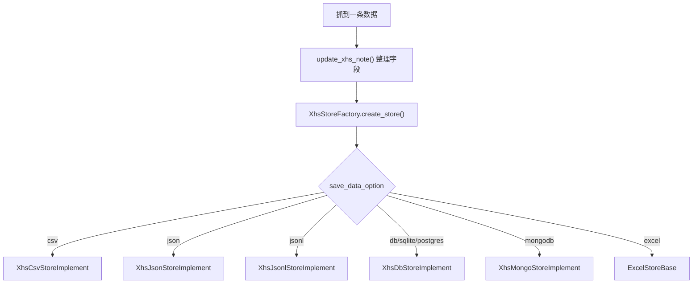

### 2.5 主流程类源码

小白看主流程，建议只看一个平台：小红书。

文件：`media_platform/xhs/core.py`

核心类：`XiaoHongShuCrawler`，第 51 行。

核心方法：

| 方法 | 位置 | 作用 |
|---|---:|---|
| `start()` | 第 65-127 行 | 总入口 |
| `search()` | 第 129-185 行 | 搜索关键词 |
| `get_specified_notes()` | 第 246-272 行 | 抓指定笔记 |
| `get_note_detail_async_task()` | 第 274-324 行 | 抓笔记详情 |
| `batch_get_note_comments()` | 第 325-340 行 | 批量抓评论 |
| `get_comments()` | 第 342-358 行 | 抓单条笔记评论 |
| `create_xhs_client()` | 第 360-391 行 | 创建请求客户端 |
| `launch_browser()` | 第 393-421 行 | 标准方式启动浏览器 |
| `launch_browser_with_cdp()` | 第 423-450 行 | CDP 方式连接浏览器 |

主流程 `start()` 可以这样理解：

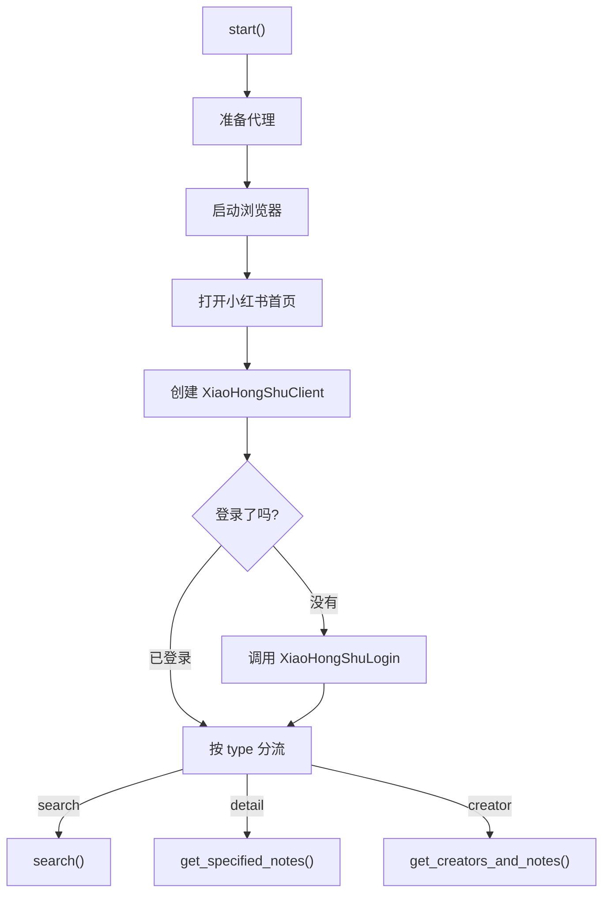

并发在哪里？

看 `media_platform/xhs/core.py` 第 161-170 行：

```python
semaphore = asyncio.Semaphore(config.MAX_CONCURRENCY_NUM)
task_list = [
    self.get_note_detail_async_task(..., semaphore=semaphore)
    for post_item in notes_res.get("items", {})
]
note_details = await asyncio.gather(*task_list)
```

小白解释：

- `Semaphore`：限制同时运行多少个任务。
- `task_list`：任务列表。
- `asyncio.gather()`：一起等待这些任务完成。

有没有生产者-消费者模型？

【未找到】典型 `asyncio.Queue` 生产者-消费者模型。  
当前是“每一页搜索结果生成一批任务，然后 `gather()` 一起等待”。

### 2.6 IP代理池实现 (1 & 2)

代理池是什么？

如果频繁请求平台，可能会触发风控。代理池的作用是准备多个代理 IP，请求时使用代理，过期后自动换。

核心文件：

| 文件 | 作用 |
|---|---|
| `proxy/proxy_ip_pool.py` | 代理池 |
| `proxy/base_proxy.py` | 代理服务商抽象类 |
| `proxy/proxy_mixin.py` | 自动刷新代理的 Mixin |
| `proxy/types.py` | 代理 IP 数据模型 |
| `proxy/providers/kuaidl_proxy.py` | 快代理 |
| `proxy/providers/wandou_http_proxy.py` | 豌豆 HTTP |

代理数据模型：

`proxy/types.py` 第 37-58 行：

```python
class IpInfoModel(BaseModel):
    ip: str
    port: int
    user: str
    password: str
    expired_time_ts: Optional[int]

    def is_expired(self, buffer_seconds: int = 30) -> bool:
        ...
```

小白理解：  
这就是一条代理 IP 的信息，包括 IP、端口、账号密码、过期时间。

代理池核心：

`proxy/proxy_ip_pool.py` 第 42-172 行。

重点方法：

| 方法 | 位置 | 作用 |
|---|---:|---|
| `load_proxies()` | 第 61-68 行 | 从服务商加载代理 |
| `_is_valid_proxy()` | 第 69-95 行 | 测试代理能不能用 |
| `get_proxy()` | 第 97-114 行 | 从池子随机取一个代理 |
| `is_current_proxy_expired()` | 第 116-126 行 | 判断当前代理是否过期 |
| `get_or_refresh_proxy()` | 第 128-142 行 | 过期就换一个 |

代理验证：

```python
# proxy/proxy_ip_pool.py:85-88
async with make_async_client(proxy=proxy_url) as client:
    response = await client.get(self.valid_ip_url)
if response.status_code == 200:
    return True
```

当前注册的代理服务商：

`proxy/proxy_ip_pool.py` 第 153-156 行：

```python
IpProxyProvider = {
    "kuaidaili": new_kuai_daili_proxy(),
    "wandouhttp": new_wandou_http_proxy(),
}
```

说明：

- 快代理：`proxy/providers/kuaidl_proxy.py`，类 `KuaiDaiLiProxy`，第 72 行。
- 豌豆 HTTP：`proxy/providers/wandou_http_proxy.py`，类 `WanDouHttpProxy`，第 36 行。
- 极速 HTTP：`proxy/providers/jishu_http_proxy.py` 文件存在，但第 23 行标注 Deprecated，且没有注册到代理池中。

代理流程图：

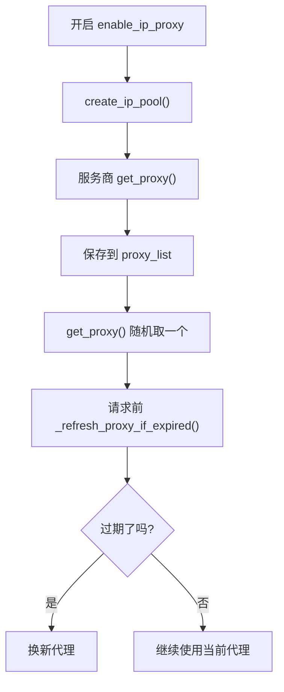

### 2.7 移除 ORM 重构讲解 / 数据库存储重构 (1 & 2)

这一节对小白有点难，先记住三个阶段：

1. 早期：项目用过 Tortoise ORM。
2. 中期：提交 `d392747` 移除了 ORM，改成 SQL 封装。
3. 当前：提交 `be306c6` 又引入 SQLAlchemy ORM，统一数据库模型。

#### 2.7.1 历史上的“移除 ORM”

git 历史里确实有提交：

```text
d392747 fix: 移除orm的所有内容
```

这个提交删除了很多 `*_store_db_types.py` 文件。  
比如重构前，小红书模型在：

```text
d392747^:store/xhs/xhs_store_db_types.py
```

关键代码：

```python
from tortoise import fields
from tortoise.models import Model

class XhsBaseModel(Model):
    id = fields.IntField(pk=True, autoincrement=True)
```

小白解释：  
这说明当时使用的是 Tortoise ORM，数据库表被写成 Python 类。

重构后，存储实现改成调用 SQL 函数：

```python
# d392747:store/xhs/xhs_store_impl.py:96-105
from .xhs_store_sql import add_new_content, query_content_by_content_id, update_content_by_content_id
note_detail = await query_content_by_content_id(content_id=note_id)
if not note_detail:
    await add_new_content(content_item)
else:
    await update_content_by_content_id(note_id, content_item=content_item)
```

当时的 SQL 代码类似：

```python
# be306c6^:store/xhs/xhs_store_sql.py:33-35
sql = f"select * from xhs_note where note_id = '{content_id}'"
rows = await async_db_conn.query(sql)
```

小白理解：

- ORM：用 Python 类操作数据库。
- 原生 SQL：自己写 SQL 字符串操作数据库。

#### 2.7.2 当前数据库存储重构

当前项目又改成 SQLAlchemy ORM 了。

关键提交：

```text
be306c6 refactor(database): 重构数据库存储实现，使用SQLAlchemy ORM替代原始SQL操作
```

当前重点文件：

| 文件 | 作用 |
|---|---|
| `database/models.py` | 定义 SQLAlchemy ORM 模型 |
| `database/db_session.py` | 创建数据库连接和 Session |
| `database/db.py` | 初始化数据库表 |
| `store/xhs/_store_impl.py` | 平台存储逻辑 |

`database/models.py` 第 19-23 行：

```python
from sqlalchemy import create_engine, Column, Integer, Text, String, BigInteger
from sqlalchemy.ext.declarative import declarative_base

Base = declarative_base()
```

小红书表模型在 `database/models.py`：

- `XhsCreator`：第 269-283 行。
- `XhsNote`：第 285-309 行。
- `XhsNoteComment`：第 311-327 行。

数据库 Session 在 `database/db_session.py` 第 87-102 行：

```python
@asynccontextmanager
async def get_session() -> AsyncSession:
    session = AsyncSessionFactory()
    try:
        yield session
        await session.commit()
    except Exception as e:
        await session.rollback()
        raise e
    finally:
        await session.close()
```

小白解释：

- `yield session`：把数据库会话交给业务代码使用。
- `commit()`：成功就提交。
- `rollback()`：出错就回滚。
- `close()`：最后关闭会话。

【未找到】名为 `DatabaseStorage` 的统一类。  
当前实际负责数据库存储的是各平台自己的 `*DbStoreImplement`，例如：

- `XhsDbStoreImplement`：`store/xhs/_store_impl.py` 第 122 行。
- `DouyinDbStoreImplement`：`store/douyin/_store_impl.py` 第 93 行。
- `WeiboDbStoreImplement`：`store/weibo/_store_impl.py` 第 100 行。

---

## 3. 如何参与开源仓库 (Open Source Contribution)

### 3.1 熟悉项目贡献流程

先说结论：

`CONTRIBUTING.md`【未找到】。  
`.github/PULL_REQUEST_TEMPLATE.md`【未找到】。

但是仓库里有这些贡献相关文件：

| 文件 | 作用 |
|---|---|
| `.github/ISSUE_TEMPLATE/bug_report.md` | Bug 反馈模板 |
| `.github/ISSUE_TEMPLATE/quesiton.md` | 使用问题模板 |
| `.github/CODEOWNERS` | 指定代码审核人 |
| `pyproject.toml` | Python 依赖 |
| `requirements.txt` | pip 依赖 |

提 Bug 前要做什么？

看 `.github/ISSUE_TEMPLATE/bug_report.md` 第 9-15 行：

1. 先读常见问题。
2. 搜索已关闭 issues。
3. 排除 Cookie 过期、滑块验证码、平台风控等常见问题。

谁负责审核代码？

看 `.github/CODEOWNERS` 第 1-2 行：

```text
* @NanmiCoder
```

意思是默认所有文件都需要 `@NanmiCoder` 审核。

依赖怎么管理？

- 推荐 `uv sync`，见 `README.md` 第 105-113 行。
- Python 版本要求 `>=3.11`，见 `pyproject.toml` 第 7 行。
- 依赖列表在 `pyproject.toml` 第 8-43 行。

测试在哪里？

仓库里有两个测试目录：

- `tests/`
- `test/`

例如：

- `tests/test_store_factory.py`
- `tests/test_excel_store.py`
- `test/test_proxy_ip_pool.py`
- `test/test_db_sync.py`

小白贡献流程：

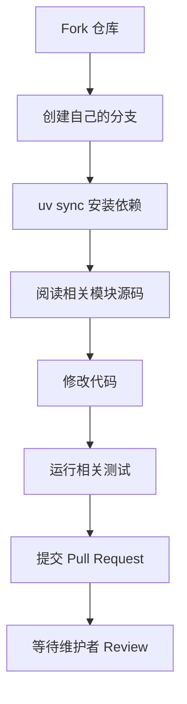

### 3.2 微信支付 SDK 开源仓库贡献

扫描结果：

- `wechat_pay_sdk`【未找到】。
- `pay_sdk`【未找到】。
- 微信支付 SDK 源码【未找到】。

仓库里只有赞赏图片：

- `README.md` 第 281 行引用 `docs/static/images/wechat_pay.jpeg`。
- `docs/捐赠名单.md` 第 10 行也引用了微信赞赏图片。

结论：  
当前 MediaCrawler 项目没有微信支付 SDK 模块，也没有微信支付相关 API。这里的微信图片只是赞赏码，不是代码功能。

---

## 4. MediaCrawlerPro 技术方案 (Advanced Architecture)

### 4.1 P1-项目基本介绍 / P2-平台原型设计

先说结论：

`MediaCrawlerPro/` 文件夹【未找到】。  
当前开源仓库里只有 Pro 的介绍文档，没有 Pro 源码。

能看到的文档：

| 文件 | 内容 |
|---|---|
| `README.md` | 第 56-80 行介绍 Pro 特性 |
| `docs/mediacrawlerpro订阅.md` | 介绍 Pro 订阅和设计方向 |

Pro 版本定位：

根据 `docs/mediacrawlerpro订阅.md` 第 36-45 行：

- 仍然支持小红书、抖音、快手、B站、微博、贴吧、知乎。
- 去掉 Playwright 依赖。
- 增加 Docker / Docker Compose 部署。
- 支持多账号 + IP 代理池。
- 新增签名服务，把签名逻辑从爬虫主流程里拆出去。

开源版的数据模型可以作为平台原型参考。

看 `database/models.py`：

| 数据类型 | 例子 | 位置 |
|---|---|---:|
| 内容 | `XhsNote` | 第 285-309 行 |
| 评论 | `XhsNoteComment` | 第 311-327 行 |
| 创作者 | `XhsCreator` | 第 269-283 行 |

小白可以把所有平台的数据都理解成三类：

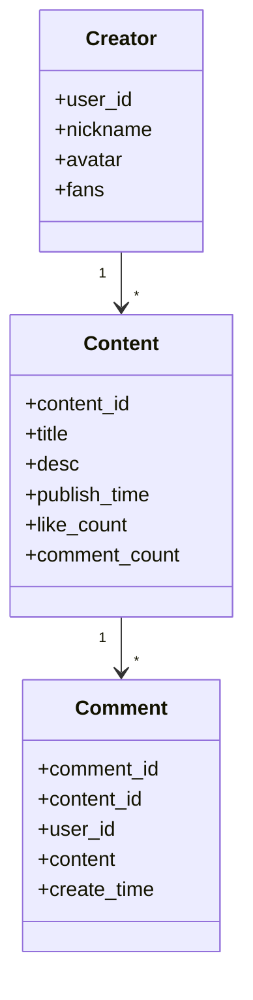

### 4.2 P3-系统架构概述

注意：下面是基于文档的架构推断，不是 Pro 源码，因为 Pro 源码【未找到】。

Pro 可能想解决开源版的这些问题：

| 开源版问题 | Pro 文档提到的方向 |
|---|---|
| Playwright 依赖重 | 去掉 Playwright |
| 单账号为主 | 多账号 |
| 代理池能力有限 | 多账号 + IP 代理池 |
| 没有断点续爬 | 断点续爬 |
| 签名逻辑在 Client 内 | 独立签名服务 |
| 部署门槛高 | Docker / Docker Compose |

高层架构图：

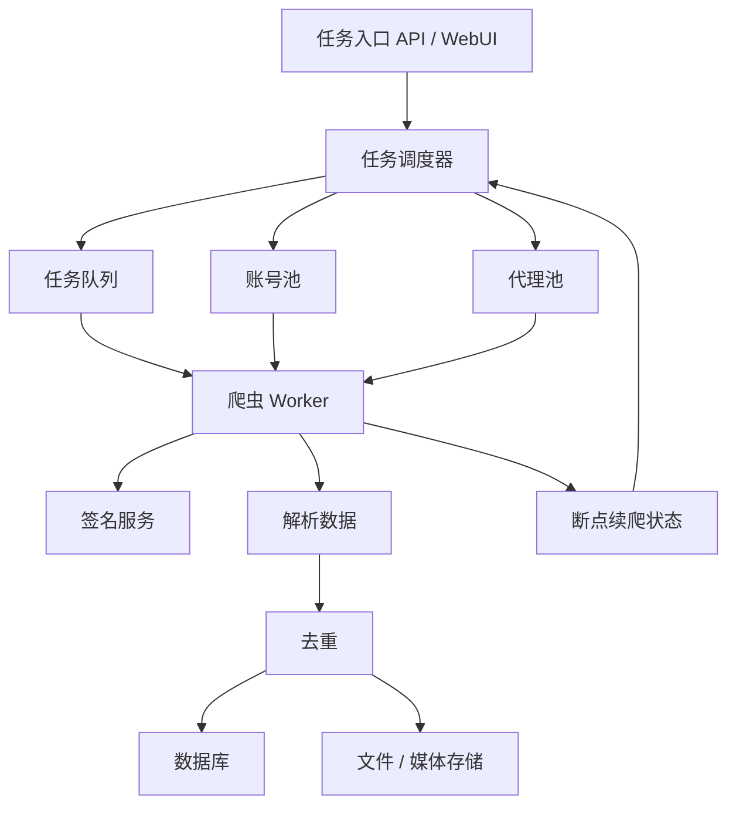

小白解释：

- 任务调度器：决定谁去抓、抓什么、什么时候抓。
- 账号池：管理多个账号和 Cookie。
- 代理池：管理多个代理 IP。
- 签名服务：专门负责生成平台请求需要的签名参数。
- 去重：避免同一条内容重复保存。
- 断点续爬：程序中断后，下次能从上次位置继续。

### 4.3 P4-详细设计之数据 / P5-详细设计之功能

P4 数据设计：

当前开源版数据库表由 SQLAlchemy 模型生成。入口在 `database/db_session.py` 第 77-84 行：

```python
async def create_tables(db_type: str = None):
    await create_database_if_not_exists(db_type)
    engine = get_async_engine(db_type)
    if engine:
        async with engine.begin() as conn:
            await conn.run_sync(Base.metadata.create_all)
```

核心表大致分三组：

| 数据 | 说明 |
|---|---|
| 内容表 | 笔记、视频、微博、帖子、回答 |
| 评论表 | 一级评论、二级评论 |
| 创作者表 | 用户、博主、UP主、答主 |

以小红书为例：

| 表模型 | 文件位置 | 作用 |
|---|---:|---|
| `XhsCreator` | `database/models.py:269-283` | 创作者 |
| `XhsNote` | `database/models.py:285-309` | 笔记 |
| `XhsNoteComment` | `database/models.py:311-327` | 评论 |

P5 功能设计：

| 功能 | 开源版现状 | 小白理解 |
|---|---|---|
| 大规模抓取 | 用 `Semaphore + gather` 控制并发 | 同时跑多个任务，但还不是分布式 |
| 去重 | DB 里通常先查再新增/更新 | 有了就更新，没有就插入 |
| 断点续爬 | 【未找到】完整 checkpoint 模块 | 开源版目前没有完善断点续爬 |
| 多账号 | 【未找到】账号池 | 主要依赖当前浏览器登录态 |
| 签名服务 | 签名在各平台 Client 内 | Pro 文档说会拆成独立服务 |

小红书去重例子：

`store/xhs/_store_impl.py` 第 179-182 行：

```python
async def content_is_exist(self, session: AsyncSession, note_id: str) -> bool:
    stmt = select(XhsNote).where(XhsNote.note_id == note_id)
    result = await session.execute(stmt)
    return result.first() is not None
```

这段意思是：  
根据 `note_id` 查数据库，如果查到了，就说明这条笔记已经存在。

最后给小白的阅读路线：

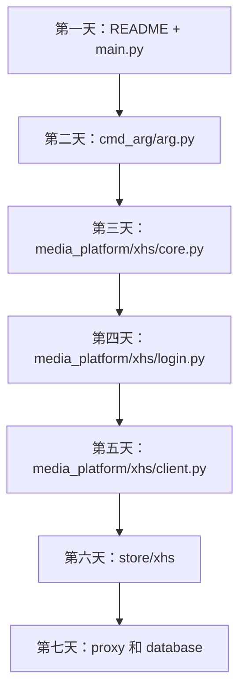

学完你应该能回答：

1. 程序从哪里启动？
2. 命令行参数怎么变成配置？
3. 平台爬虫对象怎么创建？
4. 登录态怎么保存和检查？
5. 请求是怎么发出去的？
6. 数据是怎么保存到文件或数据库的？
7. 代理池如何获取和刷新 IP？
8. 当前项目哪些功能还没有完整实现？
